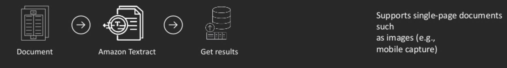

title: AWS Textract
author:
  name: Matthias Pfeil
  twitter: matpfe
  github: mpfeil
output: intro.html
controls: false
theme: jdan/cleaver-retro

--

# Using AWS Textract
## Easily extract text and data from virtually any document

--

### Amazon Textract

* announced at [Re:invent 2018](https://t3n.de/news/dokumente-digitalisieren-aws-1129192/)

* combines ML (Maschine Learning) & OCR (Optical Character Recognition) to extract text and data from documents

* still in Preview and available in `US East (N. Virginia)`, `US East (Ohio)`, `US West (Oregon)` and `EU (Ireland)`

--

### Processing of documents today

* Manual processing

* Optical Character Recognition (OCR)

* Rules and template-based extraction

--

### Today´s challenges (Manual processing)

* time-consuming
* error-prone
* expensive

<center style="padding-top: 0px;">
  
</center>

--

### Today´s challenges (OCR)

* error-prone
* no multi-column
* no rotated text
* reads left to right

<center style="padding-top: 10px;">
  
</center>

Output:
`
Extract data quickly & No code templates to accurately maintain
`

--

### Today´s challenges (Rules and template-based)

* varieties of documents
* limited by OCR (accuracy)
* development of templates

<center style="padding-top: 10px;">
  
</center>

--

### Feature - Text Extraction (OCR++)

<center style="padding-top: 50px;">
  
</center>

Blocks: `PAGE`, (`PARAGRAPH`), `LINE`, `WORD`

<center style="padding-top: 50px;">
  
</center>

--

### Feature - Key-Value Pair Extraction

<center style="padding-top: 50px;">
  
</center>

Blocks: `PAGE`, `KEY_VALUE_SET`

Each `Block` contains:
* Field name (key) and field value (value)
* Confidence score
* Block relationships

--

### Feature - Table Extraction

<center style="padding-top: 50px;">
  
</center>

Blocks (Output): `PAGE`, `TABLE`, `CELL`

Each `Block` contains:
* Text
* Confidence score
* Block relationships (e.g. cell and row)

--

### API (Sync & Async)

#### Synchronous
<center>
  
</center>

#### Asynchronous
<center>
  
</center>

--

### Examples (1) - Textract

<center style="padding-top: 50px;">
  
</center>

--

### Example (2) - Textract JSON format

```json
{
  "Geometry": {
      "BoundingBox": {...},
      "Polygon": [...]
  },
  "Relationships": [
      {
          "Type": "CHILD",
          "Ids": [
              "42fbb5b5-70a4-487c-bd14-474b21ff361b",
              "79456e5b-66b9-4c8d-8d9f-60010df23ba1",
              ...
          ]
      }
  ],
  "BlockType": "TABLE",
  "Confidence": 75.16709899902344,
  "Id": "7f056267-5222-46fe-9912-3203f4ff991e"
},
```

--

### Example (3) - Tesseract
```bash
tesseract serveimage.jpg out
```

```text
‘a Employee's social security number
123-45-6789

b Employer identification number (EIN)
11-2233445


Safe, accurate,
OMB No. 1545-0008 FAST! Use


¢ Employer's name, address, and ZIP code

The Big Company
123 Main Street
Anywhere, PA 12345

‘3 Social security wages

+ file
7 Wages, tips, other compensation] 2 Federal income tax withheld
48,500.00 6,835.00
```

--

### ML & DL (1)

#### Different sizes
<center style="padding-top: 50px;">
  
</center>

--

### ML & DL (2)

#### Associations
<center style="padding-top: 50px;">
  
</center>

--

### ML & DL (3)

#### Infer values
<center style="padding-top: 50px;">
  
</center>

--

### Costs

<center style="padding-top: 50px;">
</center>

|                        | First 1M pages/month             | 1M+ pages/month   |
| ---------------------- | :------------------------------: | ----------------: |
| Text Extraction        | $0.0015                          | $0.0006           |
| Table Extraction*      | $0.015                           | $0.01             |
| Key-Value Extraction*  | $0.05                            | $0.04             |
| All*                   | $0.065                           | $0.05             |

*OCR included